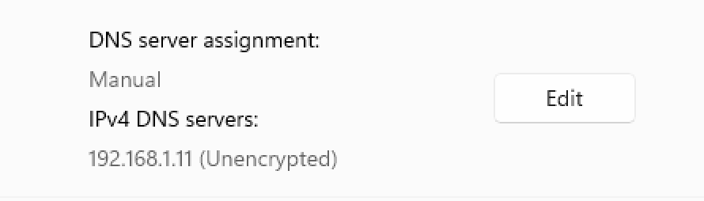
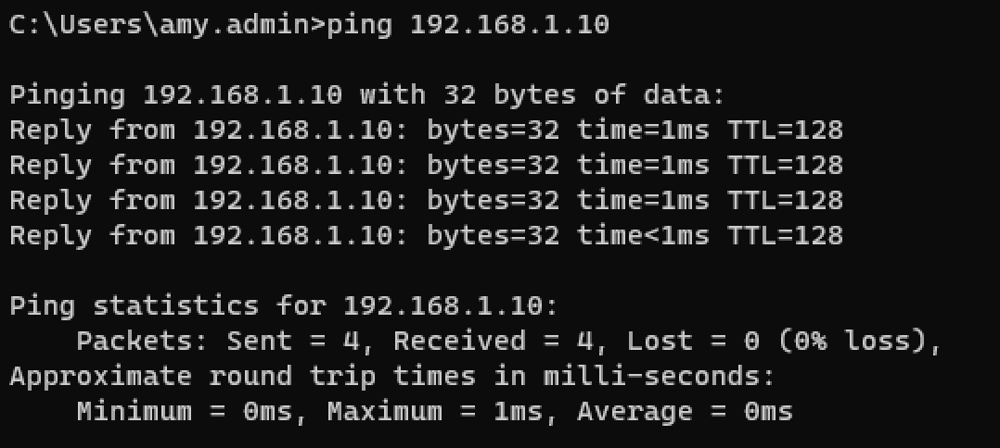
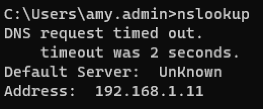
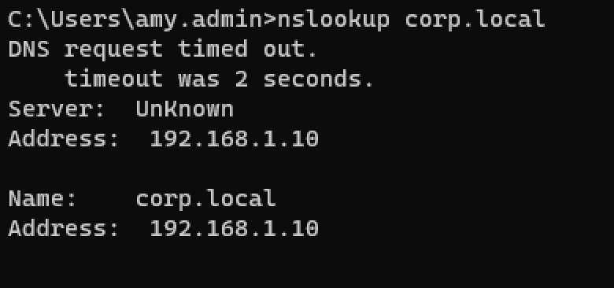
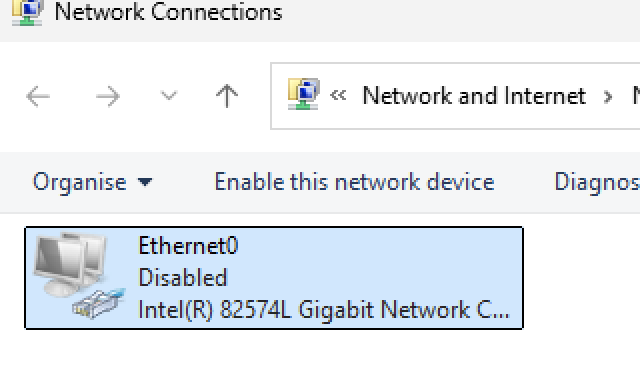
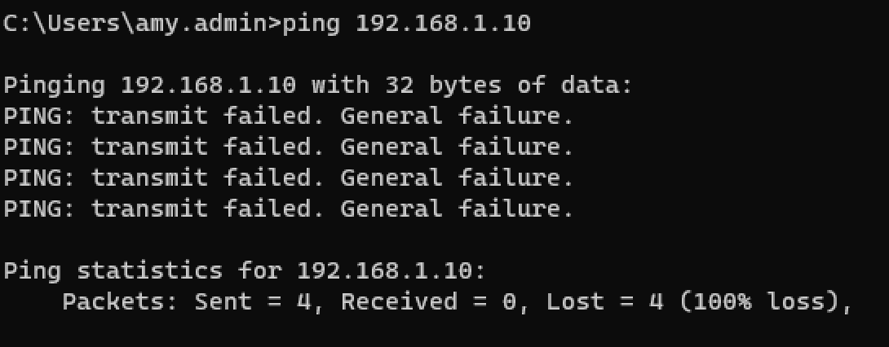
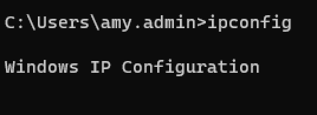
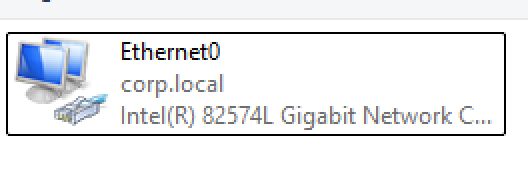
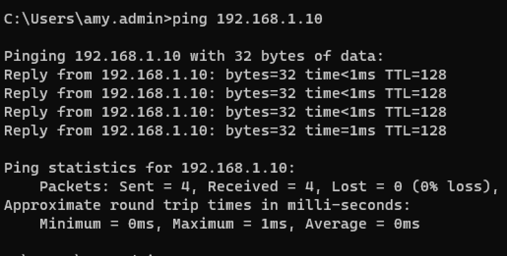

## Table of Contents

- [DNS Troubleshooting Lab](#dns-troubleshooting-lab)
- [No Network Connectivity Lab](#no-network-connectivity-lab)

# DNS Troubleshooting Lab

In this lab, I simulated a common IT support issue where a user has network connectivity but cannot access domain resources due to a DNS misconfiguration.

---

### Breaking the Configuration

On the Windows 11 client, I manually changed the DNS server to an incorrect value.

This caused domain-related services to fail while basic network connectivity still worked.

---

### Testing the Issue

I tested connectivity to the server using:

ping <Server-IP>

The ping was successful, confirming that the network connection was working.

However, when testing DNS resolution using:

nslookup 

The request failed, indicating that DNS was not resolving correctly.

---

### Fixing the Issue

I corrected the DNS settings by setting the preferred DNS server to the domain controller's IP address.

---

### Verifying the Fix

After updating the DNS settings, I tested again using:

nslookup 

This time, the domain resolved successfully, confirming the issue was fixed.

---

### What I learned

- DNS is critical for Active Directory and domain services  
- A system can have network connectivity but still fail to access domain resources  
- `ping` tests connectivity, while `nslookup` tests DNS resolution  
- Misconfigured DNS is a common cause of login and resource access issues  
- Step-by-step troubleshooting helps isolate the root cause  

This lab helped me understand how to diagnose and resolve real-world network issues in a domain environment.

# No Network Connectivity Lab

In this lab, I simulated a complete network failure on a Windows 11 client and troubleshot the issue step by step.

---

### Breaking the Network

On the Windows 11 client, I disabled the network adapter to simulate a user having no connectivity.

---

### Observing the Issue

I tested connectivity using:

ping <Server-IP>

The request failed, confirming there was no network connection.

I was also unable to access shared resources such as:

\\<Server-IP>\IT-Shared

---

### Troubleshooting

I checked the network configuration using:

ipconfig

This showed that the system was not properly connected to a network.

I then checked the network adapter settings and identified that the Ethernet adapter was disabled.

---

### Fixing the Issue

I re-enabled the network adapter using:

ncpa.cpl

After enabling the adapter, the system reconnected to the network.

---

### Verifying the Fix

I tested connectivity again using:

ping <Server-IP>

This time the ping was successful, confirming the issue was resolved.

I was also able to access shared resources again.

---

### What I learned

- How to identify a complete network failure  
- The difference between network issues (no connectivity) and DNS issues (partial connectivity)  
- How to use `ping` and `ipconfig` to troubleshoot connectivity problems  
- How to check and manage network adapters  

This lab helped me understand how to diagnose and resolve basic network issues in a real IT support scenario.
