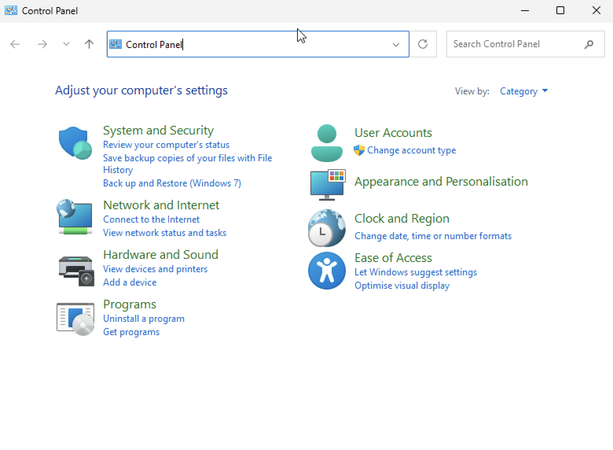
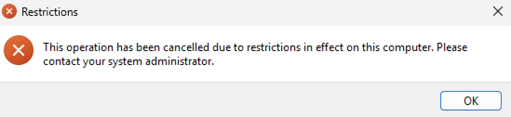
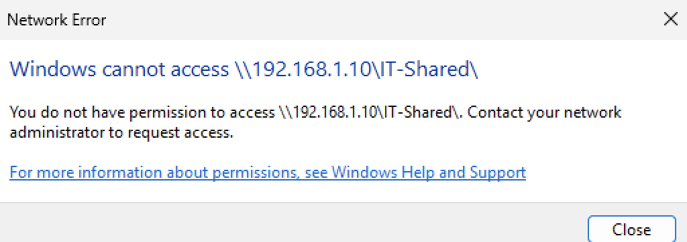
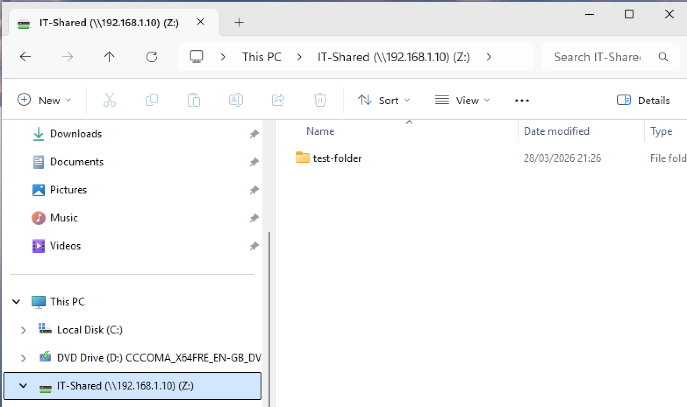
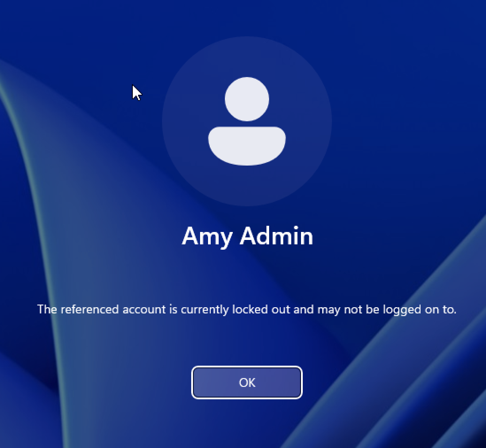
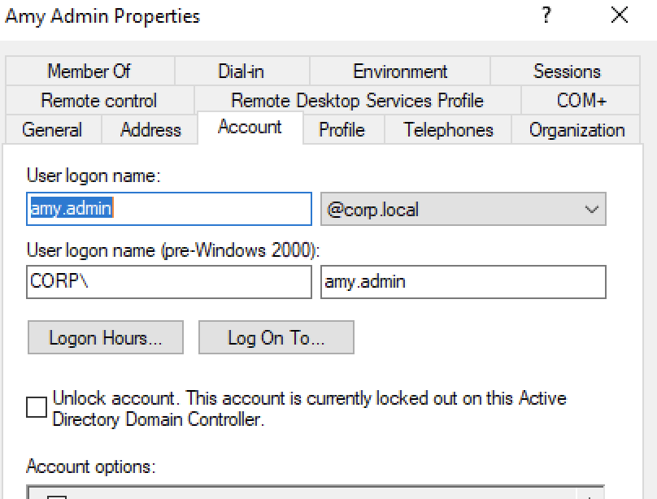
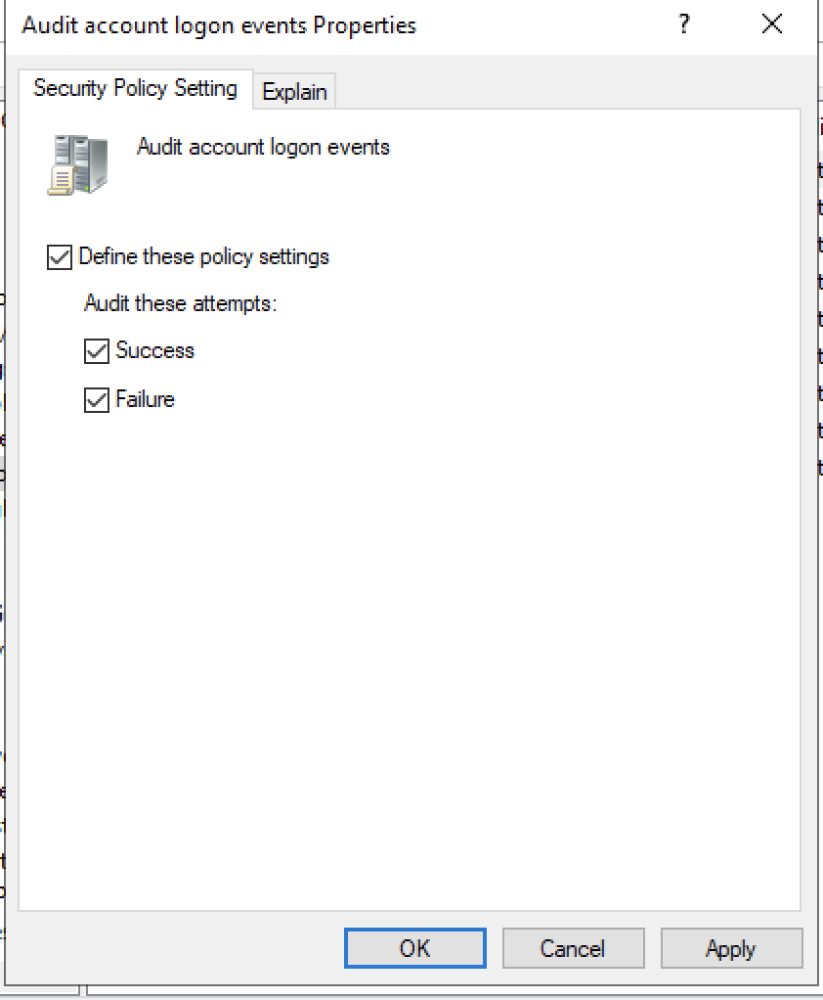
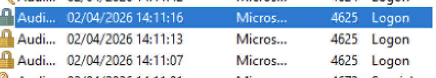

## Table of Contents

- [DNS Troubleshooting Lab](#dns-troubleshooting-lab)
- [No Network Connectivity Lab](#no-network-connectivity-lab)
- [GPO Not Applying Lab](#gpo-not-applying-lab)
- [Shared Folder Access Troubleshooting Lab](#shared-folder-access-troubleshooting-lab)
- [Account Lockout Investigation Lab](#account-lockout-investigation-lab)

## DNS Troubleshooting Lab

In this lab, I simulated a common IT support issue where a user has network connectivity but cannot access domain resources due to a DNS misconfiguration.

---

### Breaking the Configuration

On the Windows 11 client, I manually changed the DNS server to an incorrect value.

This caused domain-related services to fail while basic network connectivity still worked.

---

### Testing the Issue

I tested connectivity to the server using:

ping <Server-IP>

The ping was successful, confirming that the network connection was working.

However, when testing DNS resolution using:

nslookup 

The request failed, indicating that DNS was not resolving correctly.

---

### Fixing the Issue

I corrected the DNS settings by setting the preferred DNS server to the domain controller's IP address.

---

### Verifying the Fix

After updating the DNS settings, I tested again using:

nslookup 

This time, the domain resolved successfully, confirming the issue was fixed.

---

### What I learned

- DNS is critical for Active Directory and domain services  
- A system can have network connectivity but still fail to access domain resources  
- `ping` tests connectivity, while `nslookup` tests DNS resolution  
- Misconfigured DNS is a common cause of login and resource access issues  
- Step-by-step troubleshooting helps isolate the root cause  

This lab helped me understand how to diagnose and resolve real-world network issues in a domain environment.

## No Network Connectivity Lab

In this lab, I simulated a complete network failure on a Windows 11 client and troubleshot the issue step by step.

---

### Breaking the Network

On the Windows 11 client, I disabled the network adapter to simulate a user having no connectivity.

---

### Observing the Issue

I tested connectivity using:

ping <Server-IP>

The request failed, confirming there was no network connection.

I was also unable to access shared resources such as:

\\<Server-IP>\IT-Shared

---

### Troubleshooting

I checked the network configuration using:

ipconfig

This showed that the system was not properly connected to a network.

I then checked the network adapter settings and identified that the Ethernet adapter was disabled.

---

### Fixing the Issue

I re-enabled the network adapter using:

ncpa.cpl

After enabling the adapter, the system reconnected to the network.

---

### Verifying the Fix

I tested connectivity again using:

ping <Server-IP>

This time the ping was successful, confirming the issue was resolved.

I was also able to access shared resources again.

---

### What I learned

- How to identify a complete network failure  
- The difference between network issues (no connectivity) and DNS issues (partial connectivity)  
- How to use `ping` and `ipconfig` to troubleshoot connectivity problems  
- How to check and manage network adapters  

This lab helped me understand how to diagnose and resolve basic network issues in a real IT support scenario.

## GPO Not Applying Lab

In this lab, I simulated a common issue where a Group Policy Object (GPO) was not being applied to a user.

---

### Breaking the Policy Application

On the server, I moved the user `amy.admin` out of the `IT-Team` Organizational Unit (OU), where the GPO was originally linked.

This caused the policy to no longer apply to the user.

---

### Testing the Issue

On the Windows 11 client, I logged in as `corp\amy.admin` and attempted to access the Control Panel.

The Control Panel opened successfully, confirming that the GPO restriction was no longer applied.

---

### Fixing the Issue

I moved the user back into the `IT-Team` OU on the server.

Then, on the client, I refreshed Group Policy using:

gpupdate /force

---

### Verifying the Fix

After updating the policy, I tested again by trying to open the Control Panel.

Access was now blocked, confirming that the GPO was correctly applied.

---

### What I learned

- GPOs are applied based on the user’s OU location  
- Moving a user out of an OU can prevent policies from applying  
- `gpupdate /force` can be used to refresh policies immediately  
- Troubleshooting GPO issues requires checking OU structure and policy scope  

This lab helped me understand how to diagnose and resolve Group Policy issues in a domain environment.

## Shared Folder Access Troubleshooting Lab

In this lab, I simulated a shared folder access issue and troubleshot the problem from both the client and server side.

---

### Breaking Access

On the server, I modified the shared folder configuration by stopping sharing or removing permissions from the `IT-Shared` folder.

---

### Testing the Issue

On the Windows 11 client, I attempted to access the shared folder using:

\\<Server-IP>\IT-Shared

The request failed, confirming that the user could not access the resource.

---

### Troubleshooting

I identified that the issue was not related to network connectivity, as the server was reachable.

I then checked the shared folder settings on the server and found that sharing or permissions had been removed.

---

### Fixing the Issue

I re-enabled sharing on the folder and restored the appropriate permissions for the user/group.

---

### Verifying the Fix

I tested access again from the Windows 11 client and was able to successfully open the shared folder.

---

### What I learned

- Shared folder access depends on both network connectivity and server-side configuration  
- Issues can occur if sharing is disabled or permissions are misconfigured  
- Troubleshooting requires checking both client and server sides  
- Accessing a resource via network path helps confirm connectivity  

This lab helped me understand how to diagnose and resolve file sharing issues in a domain environment.

## Account Lockout Investigation Lab

In this lab, I simulated and investigated a user account lockout in an Active Directory environment.

---

### Triggering the Lockout

On the Windows 11 client, I entered an incorrect password multiple times until the account reached the configured lockout threshold.

This resulted in the account being locked.

---

### Confirming on Active Directory

On the Windows Server, I opened Active Directory Users and Computers and checked the user account.

The account was shown as locked, confirming the lockout.

---

### Enabling Audit Logging

Initially, failed login events were not visible in Event Viewer.

To investigate properly, I enabled auditing in Group Policy:

Computer Configuration → Policies → Windows Settings → Security Settings → Local Policies → Audit Policy → Audit logon events

I enabled both Success and Failure logging.

---

### Investigating Failed Logins

After applying the policy and triggering failed logins again, I used Event Viewer on the client:

Event Viewer → Windows Logs → Security

I identified failed login attempts using:

Event ID 4625

---

### Fixing the Issue

On the server, I unlocked the user account via:

Active Directory Users and Computers → User Properties → Account → Unlock account

---

### Verifying the Fix

I logged back into the Windows 11 client using the correct password, confirming the issue was resolved.

---

### What I learned

- How account lockout policies work in Active Directory  
- How to identify and investigate failed login attempts  
- How to enable audit logging to gain visibility into security events  
- How to use Event Viewer to analyse login activity  
- How to unlock user accounts and restore access  

This lab helped me understand how account lockouts occur and how to investigate them, which is important for both IT support and security monitoring.
